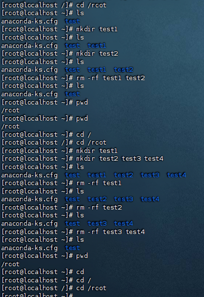

# python

##  总原则
- 不背、不抄、不看长教程
- 只做三件事：默写 -> 仿写 -> 改写
- 写错随便，允许查，但全程必须自己敲下来
<!-- more -->
## 任务一：默写两个函数（不看任何东西，硬着头皮写下来）
1. 写一个求和的函数
2. 写一个打招呼的函数
```python
# 求和的函数
def sum():
    float a, b, s
    a.input() = print("请输入一个数字a：")
    b.input() = print("请输入另一个数字b：")
    s = print(f"数字a：{a} + 数字b：{b} = {a + b}")
    return s

# 打招呼的函数
def hello():
    print("你好呀！")
```

## 任务二：对照改错，再默写1遍（没有错，就优化）
1. `float a, b, s`这行不需要写，python是动态语言，不用提前声明变量类型，直接使用即可
2. `a.input() = print()`写反了，`print()`是“输出”，`input()`是“输入”，正确写法是：`a = float(input("请输入一个数字a："))`  
3. `s = print()`不对，`print()`函数的作用只是在屏幕上显示文字，本身没有返回值或者返回None 所以`return`会没有东西返回
4. 函数写了但没有调用，等于白写
```python
# 改错后
def sum():
    a = float(input("请输入一个数字a："))
    b = float(input("请输入一个数字b："))
    s = a + b
    print(f"数字a：{a} + 数字b：{b} = {s}")
    return s

def hello():
    print("你好呀！")

if  __name__ == '__main__':
    sum()
    hello()
```

## 任务三：仿写1个新函数（比如：写个乘法的函数）
```python
def multiply():
    a = float(input("请输入一个数字a："))
    b = float(input("请输入一个数字b："))
    m = a * b
    # 改正，没有打印，运行看不到结果，需要加print()
    print(f"数字a：{a} * 数字b：{b} = {m}")
    return m

if __name__ == "__main__":
    multiply()

```

## 验收标准
1. 能独自写出大概结构
2. 写错再改，改完再写1遍


# Linux

## 总原则
1. 这个命令是干什么用的？
2. 这个命令怎么写？
3. 这个命令我能用在哪里？

## 任务一：只练习5个命令，每个敲3遍
```bash
pwd
ls
cd /
mkdir test
rm -rf test
```

<details>

<summary>点击展开隐藏内容</summary>

```bash
# 查看当前所在目录
pwd 
# 查看当前目录内容
ls
# 移动到根目录
cd /
# 创建目录test
mkdir test
# 强制递归删除目录test
rm -rf test
```
</details>





## 验收标准
1. 熟练敲5个Linux命令
2. 知道它们的作用
